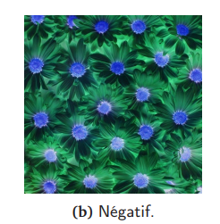

#### Programme de traitement d'images en format .bmp, prenant en charge les formats .bmp8 (image en niveau de gris) et .bmp24 (image en couleur)

## Utilisation

### Avec les images de base
Pour l'instant, le programme utilise les images `lena_gray.bmp` et `lena_color.bmp` de base.
Pour effectuer les modifications sur ces images, il suffit d'executer main.exe
/!\ sous windows, il est nécessaire d'avoir un compilateur. Voir la page officielle de gnu si vous n'en avez pas encore installer un : https://gcc.gnu.org/install/index.html

### Avec une image customisée
Pour modifier l'image utilisé, il suffit de mettre votre fichier à la même arborescence que le programme ( `\[chemin d'installation\]/Image_processing/\[ICI\]` ), et de mettre votre nom de fichier à la place de `lena_gray.bmp` ou `lena_color.bmp` selon le type de bmp utilisé.

Ensuite, il sera nécessaire de compiler le programme, avec les commandes suivantes :
> gcc -c main.c \
> gcc -c bmp24.c \
> gcc -c bmp8.c \
> gcc -c egalisation.c \
> gcc main.o egalisation.o bmp24.o bmp8.o -o main.exe

Après cette étape, il suffit d'executer `main.exe`

## Fonctionnalités 
### Traitement d’une image en niveaux de gris :
* Affichage des données de l'image (largeur, hauteur, profondeur de couleur, taille)

* Inversion des couleurs : 

* Changement de luminosité : 

* Transformation en image binaire : 

* Filtres : 
	* box_blur
	* gaussian_blur
	* outline
	* emboss
	* sharpen
	* custom

* Égalisation d’histogramme :

### Traitement d’une image en couleur :

* negative :

	
* grayscale :

* brightness :

* Filtres de convolution :
	* boxBlur
	* gaussianBlur
	* outline
	* emboss
	* sharpen 
    * custom

* Égalisation d’histogramme :
	

## Bugs connus

* Saisie d'un caractère / chaine de caractère lors de la demande d'une valeur entière
